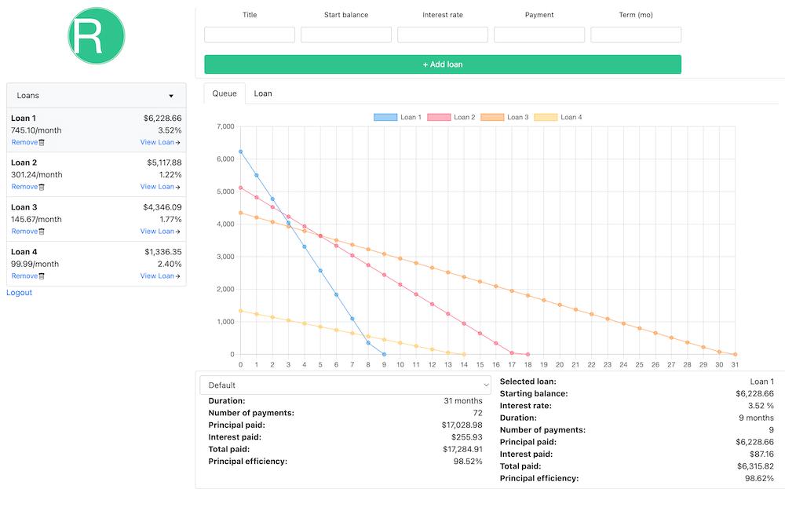

# RepayMint

RepayMint is a full-stack web application for comparing loan repayment strategies. It's based around [financetools](https://github.com/TurbulentRice/financetools), a Python package I wrote while paying off my student loans, to help conceptualize the many "What if's" that arose:

- What if I increase/decrease my monthly payment?
- What if I target payments to a single loan at a time?
- What if I allocate payments based on certain factors, like interest rate?

The problem this app aims to solve is:

- What is the fastest, cheapest way to pay off all my debt?

__NOTE__: You can install [financetools](https://github.com/TurbulentRice/financetools) via `pip install git+https://github.com/TurbulentRice/financetools.git`



## Requirements
- Python 3.9+
- MySQL 8.0+
- Node.js (see [.nvmrc](.nvmrc))
- [Optional] [Node Version Manager](https://github.com/nvm-sh/nvm)

## Stack
- [Flask](https://flask.palletsprojects.com/en/3.0.x/)
- [Preact](https://preactjs.com/) + [Vite](https://vitejs.dev/)
- [MySQL](https://dev.mysql.com/downloads/mysql/)

## Getting Started

First, set up the back-end:
```sh
# Make sure the local Python executable is v3.9+
python -V
# Create virtual environment at project root
python -m venv venv
# Activate venv
source venv/bin/activate
# Install dependencies
pip install -r requirements.txt
# Run the Flask server in debug mode
flask --app app run --debug
```

In a new terminal, set up the front-end:
```sh
cd client/
# Install or use the Node version from .nvmrc if using nvm
nvm install
nvm use
# Install dependencies
npm install
# Build the static Preact HTML/JS/CSS files in dist/
npm run build
# Run the dev server (proxies API requests to Flask server)
npm run dev
```
